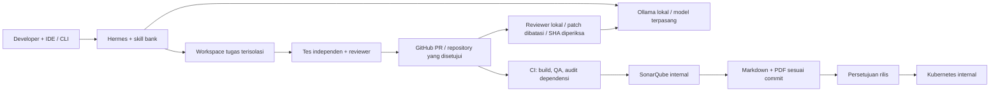

# Hermes untuk engineering bank

Pemilik PoC: Bayuzen Ahmad. Fokus produk: coding assistant dengan inferensi lokal,
kontrak tugas, pemeriksaan independen dan bukti perubahan yang bisa ditinjau.
Website Muamalat adalah workload sintetis, bukan layanan bank atau klaim afiliasi.

## Batas sistem

Inferensi lokal tidak berarti seluruh proses offline. GitHub menerima source sintetis
yang dipush; registry paket dan image menyediakan dependensi. Model tidak menerima
token GitHub atau kredensial Sonar. Reviewer mengambil patch melalui API, membatasi
ukuran, memakai endpoint loopback literal, menolak redirect/proxy dan model remote,
lalu memeriksa ulang SHA PR. Temuan bersifat advisory; tidak ada auto-merge.

## Implementasi PoC yang dapat direproduksi

- Windows, RAM 64 GB, RTX 5060 Ti 16 GB; satu pekerjaan inferensi pada satu waktu.
- Hermes 0.18.2 membutuhkan konteks model dan runtime minimum 64k; model 32k
  ditolak sebelum coding. Digest model dan konteks dicatat pada laporan preflight.
- React/Vite -> Express 5 -> PostgreSQL 17. Build frontend disajikan API pada origin
  yang sama. Tidak ada CDN, font remote, analitik atau koneksi core banking.
- Nama/email dienkripsi AES-256-GCM; lookup email memakai kunci HMAC terpisah;
  password scrypt; session token hanya hash di DB; cookie HttpOnly/SameSite Strict.
- Transfer memakai integer IDR, transaksi DB, row lock, ownership dan idempotency.
- CI publik GitHub dipakai hanya untuk source/data sintetis PoC ini. Sonar ephemeral
  berjalan di runner CI. Jalur produksi harus menggunakan runner dan Sonar internal.
- Kubernetes lokal memakai kind, namespace bank-poc, non-root, root filesystem read-only,
  tanpa token service account, resource limits dan readiness. DB lokal disposable.
- NetworkPolicy disediakan, tetapi CNI bawaan kind tidak menegakkannya. Keberadaan
  YAML bukan bukti egress isolation; uji allow/deny diperlukan pada CNI internal.

## Desain target penawaran klien

1. IDE/CLI melalui SSO perusahaan; akses proyek berdasarkan grup dan peran.
2. Runner agent per tugas, workspace sementara, tanpa kredensial pengguna/host;
   egress deny by default dan allowlist model gateway, Git internal serta registry.
3. Model server di jaringan internal. Queue dan batas konkurensi; cache prompt dan
   log tidak boleh menyalin source sensitif tanpa klasifikasi/retensi yang disetujui.
4. GitHub Enterprise/Git server yang disetujui bank, protected branch, CODEOWNERS,
   minimal dua peran untuk author dan approver. Token read-only untuk review.
5. Runner build ephemeral terpisah dari runner model. Jangan menjalankan kode PR
   yang tidak dipercaya pada host model yang memiliki akses jaringan sensitif.
6. Vault/KMS/HSM dan rotasi kunci; PostgreSQL ber-HA, backup terenkripsi dan restore
   yang diuji; audit append-only ke SIEM dengan akses terbatas.
7. Image registry internal, digest immutable, SBOM, vulnerability scan, signature
   dan admission policy. Deployment memerlukan persetujuan environment serta rollback.

Bagian target di atas adalah pekerjaan implementasi, bukan kemampuan yang seluruhnya
telah terbukti pada laptop. Prompt/skill dan pengecekan konfigurasi tidak menggantikan
sandbox OS, kontrol jaringan, governance atau persetujuan keamanan bank.

## Kriteria penerimaan agent sebelum penjualan produksi

Uji minimal 30 tugas representatif dari frontend, backend, SQL, DevOps dan review,
masing-masing 3 pengulangan pada snapshot yang sama. Catat pass@1, tingkat selesai
setelah feedback, waktu, intervensi reviewer, regresi, false positive dan false negative.
Bandingkan Copilot hanya pada fixture sintetis yang sama dengan tool/time budget sama.
Ambang pilot usulan: >=80% tugas diterima setelah maksimal dua perbaikan, 0 temuan
critical yang terlewat pada seeded security suite, dan seluruh perubahan melewati CI.
Ambang ini merupakan usulan penerimaan, bukan hasil yang sudah dicapai PoC kecil ini.

## Referensi

- [Hermes source dan lisensi](https://github.com/NousResearch/hermes-agent)
- [Qwen3-Coder model card](https://huggingface.co/Qwen/Qwen3-Coder-30B-A3B-Instruct)
- [kind quick start](https://kind.sigs.k8s.io/docs/user/quick-start/)
- [Sonar quality gates](https://docs.sonarsource.com/sonarqube-community-build/quality-standards-administration/managing-quality-gates/introduction-to-quality-gates)
